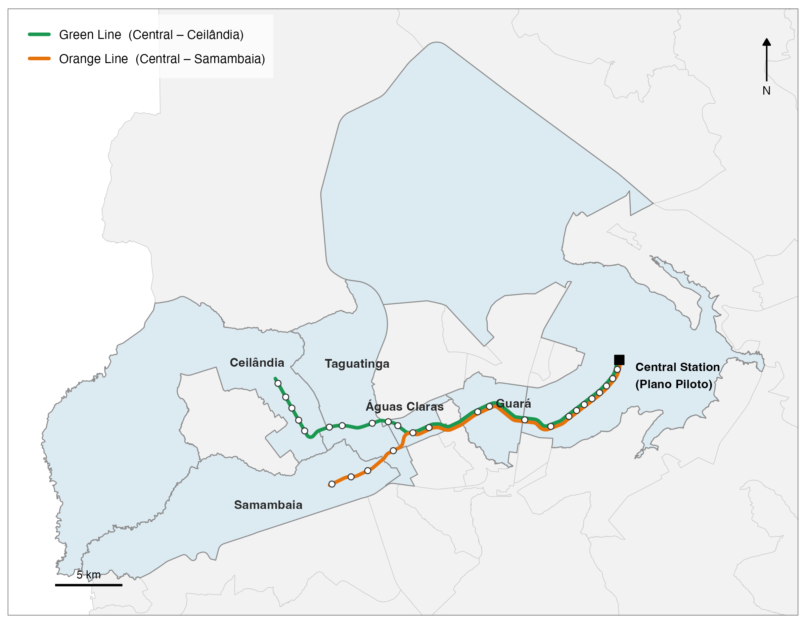

# Subways and Local Income Growth: Evidence from Brasília

**Lucas Dutra de Paulo** · Ph.D. in Economics, Catholic University of Brasília (UCB)

Working paper (draft) · **[Read the paper (PDF)](paper/main_paper.pdf)**

> Does a subway raise the income of the residents who already lived in the areas it serves, or does it only change who lives there?

<p align="center">
  
  <br>
  <em>The Brasília subway system and the administrative regions it serves (Figure 1 of the paper).</em>
</p>

## Abstract

Evidence that mass transit raises local income does not settle whether the gains reach the residents who already lived in the areas it serves, and most of it comes from advanced economies. This paper addresses this gap by studying the effect of the Brasília subway on local income. Brasília, a planned capital whose core is legally protected from densification, is an extreme case of a city where residents cannot move closer to jobs. Using census-tract data for 2000 and 2010 and an instrumental-variable strategy based on a planned and discarded subway alignment, we find that tracts exposed to the subway experienced income growth approximately 10 to 11 percent higher than comparable unexposed tracts. We find no evidence that this gain reflects physical restructuring of exposed areas or the replacement of lower-income residents by wealthier ones. In addition, both the share of household heads with positive income and the average income of those who already had it rise more in exposed tracts, consistent with a labor-market channel. Overall, the results indicate that, where moving closer to jobs is not an option, a subway can raise the income of the residents who stay.

## The paper in brief

**Setting.** Brasília's core, the *Plano Piloto*, is legally protected from densification and concentrates the city's jobs, while most residents live in satellite cities and cannot move closer to work. The subway (in service since September 2001; today two lines, 27 stations, 42 km of track and six administrative regions) is therefore a natural case for asking whether transit can raise the income of the workers who stay where they are.

**Approach.**

- **Unit and outcome.** Census tracts of the Federal District. The outcome is the change in log per-capita income between the 2000 and 2010 censuses. Per-capita income is the monthly income declared by household heads divided by the number of residents (the 2000 Census does not publish total income for all residents by tract); heads are more likely than other household members to be long-term residents of the tract.
- **Exposure.** A tract is exposed if its centroid lies within 1 km of a subway station that was open when the 2010 Census was taken (24 stations).
- **Identification.** Two-stage least squares. Subway placement is instrumented with proximity to a subway alignment that was planned in 1986–87 by the Mauá Institute of Technology (IMT) and then discarded, with administrative-region fixed effects, standard errors clustered by region, and a sample of tracts within 10 km of a station.
- **Robustness.** Sample radius, distance threshold, continuous exposure measures, tract-level clustering and Conley spatial standard errors.
- **Mechanisms.** Two tests rule out alternative explanations (physical restructuring of the area; demographic sorting). A third gives a positive, proxy-based argument for a labor-market channel.

**What is new.**

1. Causal evidence on the income effect of subway exposure in a developing-country city.
2. Identification with a planned-and-discarded alignment, at the fine-grained census-tract level.
3. Evidence that the income gains appear to reflect residents who already lived there, unlike studies of U.S. and French cities that attribute local gains to changes in who lives or works in the area (Heilmann 2018; Mayer and Trevien 2017; Tyndall 2021).

### Main results

| | (1) | (2) | (3) | (4) |
|---|:-:|:-:|:-:|:-:|
| Effect of subway exposure on income growth, 2000–2010 (2SLS) | 0.1087** | 0.0986* | 0.1066** | 0.1009** |
| Standard error | (0.0522) | (0.0497) | (0.0482) | (0.0450) |
| Controls | baseline income | + geography | + socioeconomic | all |
| First-stage *F*-statistic | 816 | 806 | 733 | 734 |

*N* = 1,692 tracts, administrative-region fixed effects in all columns, standard errors clustered by region. \* *p* < 0.1, \*\* *p* < 0.05 (Table 2 of the paper). The estimate in column 4 is 0.101 log points, that is, income growth about 10.6 percent higher in exposed tracts (e^0.101 − 1). The estimates stay positive and of similar magnitude across sample radii of 5–20 km, distance thresholds of 500–2,500 m, three continuous exposure measures, tract-level clustering and Conley standard errors (Tables 3–7). Because the instrument is built from the distance to the planned *line* rather than to planned stations, the estimates are best read as a lower bound.

### Why the gain is not about who lives there

| Hypothesis | Outcomes tested | Result |
|---|---|---|
| **H1. Urban structure** (physical densification drives the gain) | Population, households, apartment share, urban land cover | No sign of densification: population and household growth are, if anything, lower in exposed tracts (10% level); no significant effect on apartment share or urban land cover |
| **H2. Demographic composition** (richer households replace poorer ones) | Large-family share, head illiteracy, high-income head share, elderly share, working-age share | No coherent pattern; the only significant coefficient (elderly share, 10% level) has the opposite sign to sorting |
| **H3. Labor-market channel** (proxy for improved job access) | Share of household heads with positive income (extensive margin); average income of heads with income (intensive margin) | Both rise in exposed tracts (5% level) |

H1 and H2 rule out alternative explanations. H3 adds a positive argument for the same conclusion. Job access itself is not measured, so H3 is a proxy-based test and is read as *consistent with* real income gains for incumbent residents (Tables 8–10).

## Repository guide

```
.
├── README.md
├── paper/                    Manuscript
│   ├── main_paper.pdf        Compiled paper
│   ├── main_paper.tex        LaTeX entry point
│   ├── sections/             00_frontmatter … 07_appendix
│   ├── images/               Figures used in the paper
│   └── sample.bib, econ_aer.bst
├── R/                        Pipeline functions, numbered by stage
├── _targets.R                {targets} pipeline definition
├── data/
│   ├── raw/                  IBGE census tables and shapefiles (see data/README.md)
│   └── processed/            Analysis dataset produced by the pipeline
└── thesis.Rproj              RStudio project
```

## Reproducing the results

The analysis is an R pipeline built with [`{targets}`](https://docs.ropensci.org/targets/).

**Requirements.** R 4.5 or later (tested with 4.5.1), an internet connection (census-tract boundaries are downloaded with `geobr` whenever those targets run; if the server is temporarily unavailable, run `tar_make()` again a few minutes later), and these packages: `targets`, `sf`, `geobr`, `readxl`, `dplyr`, `tidyr`, `readr`, `units`, `httr`, `ggplot2`, `AER`, `fixest`, `magrittr`, `here`, `terra`, `spdep`. Tested versions: targets 1.11.4, sf 1.0.23, geobr 1.9.1, fixest 0.13.2, terra 1.9.1, spdep 1.4.2. To rebuild the PDF you also need a LaTeX distribution with `latexmk`.

**Run.** Open `thesis.Rproj` (or set the working directory to the repository root) and run:

```r
# 1. Fetch the MapBiomas rasters (Federal District window only, about 2 MB in total)
source("data/raw/mapbiomas/download_mapbiomas.R")

# 2. Run the whole pipeline (takes a few minutes)
targets::tar_make()

targets::tar_read(results_main)   # e.g., Table 2
```

To run without the MapBiomas rasters, skip step 1 and build everything else with `targets::tar_make(names = !c(census_urbanization, urbanization_sample, results_urbanization))`. To rebuild the paper: `cd paper && latexmk -pdf main_paper.tex`.

**Where each item of the paper comes from.**

| Paper item | Script in `R/` | Target |
|---|---|---|
| Figure 1: subway system map | `19_subway_system_map.R` | `subway_system_map` |
| Figure 2: census tracts and subway (2000, 2010) | made outside the R pipeline | – |
| Table 1: descriptive statistics | `5b_descriptive_statistics.R` | `descriptive_table` |
| Table 2: main 2SLS estimates | `6_main_regressions.R` | `results_main` |
| Table 3: sample radii | `7_robustness_sample_radius.R` | `results_robustness_sample_radius` |
| Table 4: distance thresholds | `8_robustness_threshold.R` | `results_robustness_threshold` |
| Table 5: continuous exposure | `9_robustness_intensity.R` | `results_robustness_intensity` |
| Table 6: clustering | `15_robustness_clustering.R` | `results_robustness_clustering` |
| Table 7, Table B.1: Conley standard errors, Moran's *I* | `16_robustness_conley.R` | `results_robustness_conley` |
| Table 8: urban structure | `11_sorting.R`, `12_urbanization_regressions.R` | `results_population`, `results_households`, `results_apartment_share`, `results_urbanization` |
| Table 9: demographic composition | `13_composition_regressions.R` | `results_composition` |
| Table 10: labor-market margins | `17_labor_market_mechanism.R` | `results_labor_market` |
| Tables C.1–C.2: land-use permissiveness (CfAM) | `18_heterogeneity_cfam.R` | `results_heterogeneity_cfam` |
| Table D.1: OLS estimates | `14_ols_regressions.R` | `results_ols` |
| Appendix A: census-tract harmonization | `3_tract_harmonization.R` | `census_harmonized` |

Scripts `1_shapefiles.R`, `2_census_data.R`, `3_tract_harmonization.R`, `4_new_variables.R` and `4b_mapbiomas_urbanization.R` build the analysis dataset (shapefiles, census tables, harmonized tracts, exposure and instrument variables). `5_covariate_analysis.R` and `10_heterogeneity_by_RA.R` are exploratory and are not used in the current draft. In the code, *RA* stands for administrative region (*região administrativa*).

## Data

Raw inputs are IBGE census tables for the Federal District (2000 and 2010) and shapefiles for the subway lines and stations, the planned IMT alignment, administrative regions and highways. The analysis dataset (one row per census tract and year) is in `data/processed/` as a GeoPackage and as a CSV. Sources, licensing notes and a description of the key variables are in [`data/README.md`](data/README.md).

## Use of AI tools

I used Claude (Anthropic) as a tool to help organize and review code and text, in the same way I use R or LaTeX. The research design, empirical analysis, results and conclusions are my own, and I am responsible for everything in this repository.

## Citation

de Paulo, L. D. (2026). *Subways and Local Income Growth: Evidence from Brasília*. Working paper. https://github.com/lucvsw/thesis
